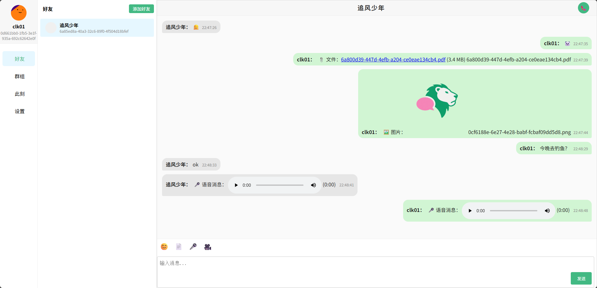

# 
#### (⌛ In Development.)
#### English | [简体中文](https://github.com/kapbl/LionChat/blob/main/README.md)
LionChat is an instant messaging backend system built with Go technology stack, leveraging Gin, GORM, Redis, WebSocket and Kafka to implement a feature-rich chat application.
#### [Frontend Project](https://github.com/kapbl/LionChat-Fronted) | [Backend Project](https://github.com/kapbl/LionChat) | [Performance Test Project](https://github.com/kapbl/Lion-Chat-Test)
[Online Demo](http://62.234.192.227:8080/) 

## 🎯 Features
- Message Fragmentation✅
- Layered Architecture✅
- Worker Pool Pattern✅
- Friends Management✅
- Private & Group Chats✅
- Text/Voice/File Messages✅
- Distributed Deployment❌
- Voice Calls✅
- Video Calls✅
- AI Chat❌
- Moments (similar to WeChat Moments)✅
- Chat History Backup❌
- Real-time Speech Transcription + Sentiment Analysis❌
- Cross-language Communication❌
- Conversation Summarization❌
- AI Assistant Help Answer Questions✅
- Docker Deployment✅
## 🎐 Local Development
- Go 1.24+
- Gin
- GORM
- Nginx
- Docker
## 🦁 Gallery
### Server Architecture

### Client Communication Flow

### 1. Chat between Friends
Friend A:

Friend B:

### 2. Voice Call between Friends

