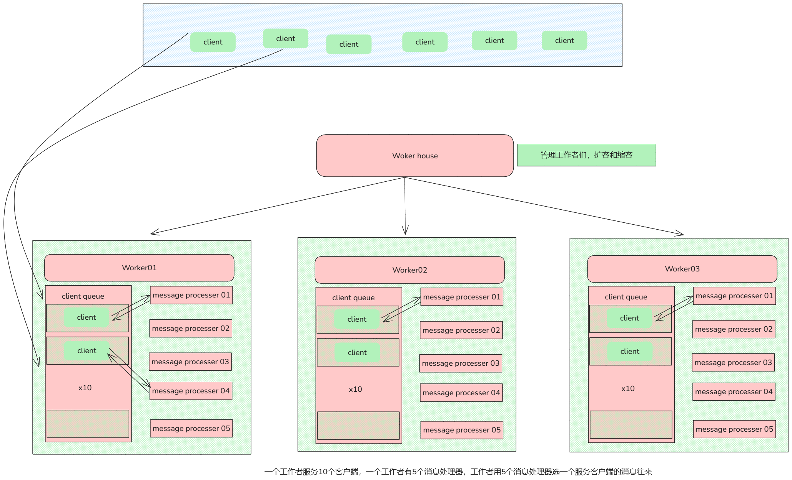
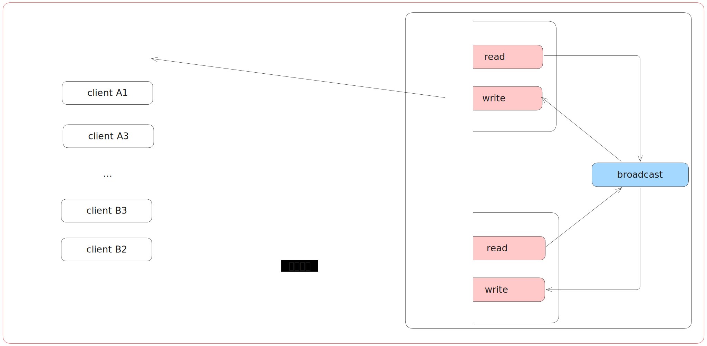
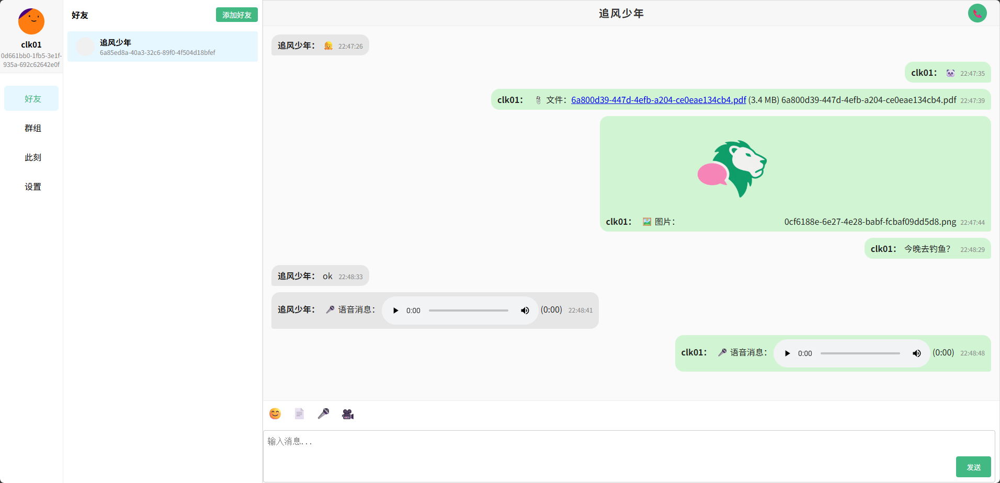
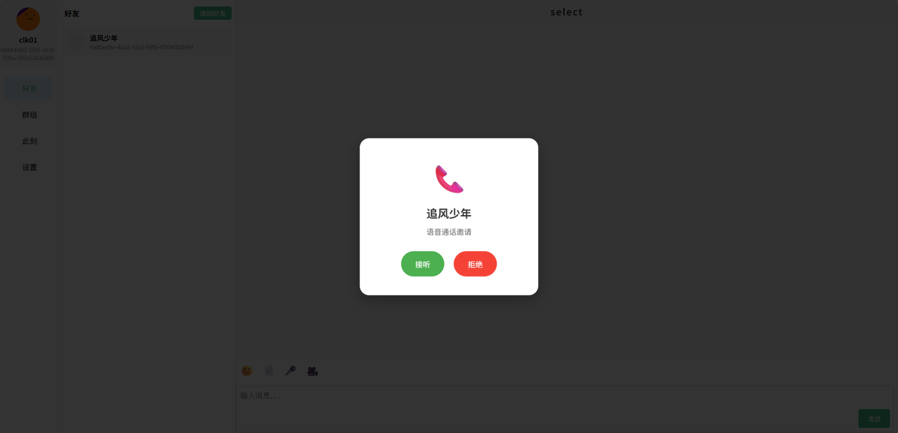
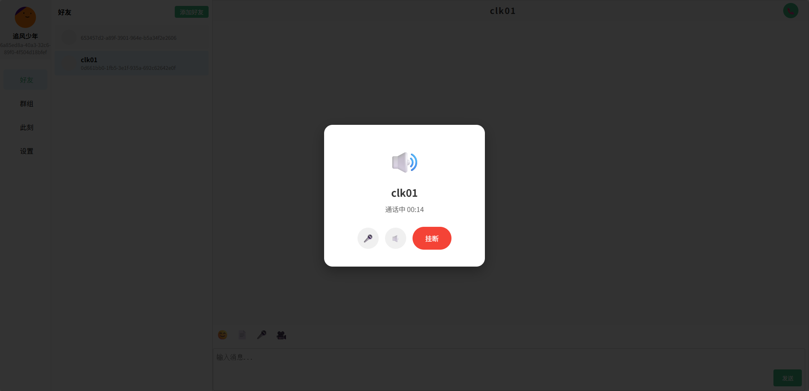
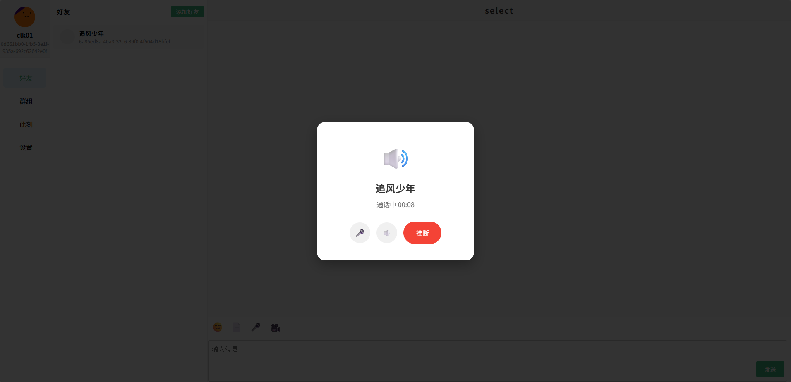

<div align="center">

# 
(⌛ 正在开发中.)
English | [简体中文]
chat lion 是一个采用 Go 技术栈构建即时通讯后端系统，使用 Gin、GORM、Redis、WebSocket 和 Kafka，实现了一个功能丰富的聊天应用。
[documentation]() | 
[前端项目](https://github.com/kapbl/LionChat-Fronted)
[后端项目](https://github.com/kapbl/LionChat)
[测试服务器运行指标的项目](https://github.com/kapbl/Lion-Chat-Test)
</div>


## 🎯 特点
- 支持消息分片✅
- 分层架构✅
- 工作池模式✅
- 好友管理✅
- 单聊和群聊✅
- 文字消息/语音消息/文件消息✅
- 支持分布式部署❌
- 语音聊天✅
- 视频聊天✅
- AI聊天❌
- 此刻(类似朋友圈)✅
- 聊天记录备份❌
- 实时语音转录+情感分析❌
- 跨语言无障碍沟通❌
- 对话摘要与决策提炼❌
- Docker部署✅
## 🎐本地开发
- Go 1.24+
- gin
- GORM
- nginx
- docker
## 🎐Docker Compose 部署
- 构建镜像
```bash
docker-compose build
```
- 运行容器
```bash
docker-compose up -d
```
## 🦁画廊
### 服务端架构

### 客户端之间的通信过程

### 1. 两个好友在聊天
好友A:

好友B:

### 2. 两个好友在语音电话



