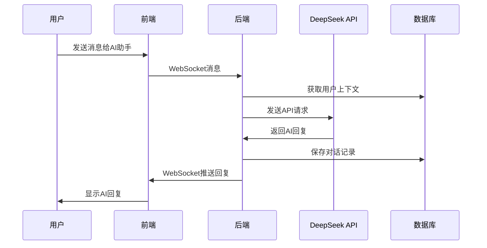

# DeepSeek聊天机器人接入设计文档

## 1. 项目概述

### 1.1 背景
LionChat是一个基于Go语言开发的即时通讯系统，支持单聊、群聊、多媒体消息等功能。目前已有基础的AI聊天功能框架，需要接入DeepSeek API来提供更强大的AI对话能力。

### 1.2 目标
- 集成DeepSeek API，提供智能对话服务
- 支持上下文记忆的连续对话
- 提供多种AI助手角色和场景
- 优化用户体验和系统性能
- 确保数据安全和隐私保护

## 2. 系统架构设计

### 2.1 整体架构
```
┌─────────────────┐    ┌─────────────────┐    ┌─────────────────┐
│   前端客户端     │    │   LionChat后端   │    │   DeepSeek API  │
│                │    │                │    │                │
│  - 聊天界面     │◄──►│  - WebSocket    │◄──►│  - Chat API     │
│  - AI助手入口   │    │  - Bot Service  │    │  - 模型推理     │
│  - 消息展示     │    │  - 上下文管理    │    │  - 流式响应     │
└─────────────────┘    └─────────────────┘    └─────────────────┘
                              │
                              ▼
                       ┌─────────────────┐
                       │   数据存储层     │
                       │                │
                       │  - MySQL        │
                       │  - Redis        │
                       │  - 对话历史     │
                       └─────────────────┘
```

### 2.2 核心组件

#### 2.2.1 DeepSeek Bot Service
- **功能**: 管理与DeepSeek API的交互
- **职责**: 
  - API请求封装
  - 响应处理
  - 错误处理和重试
  - 流式响应支持

#### 2.2.2 Context Manager
- **功能**: 管理用户对话上下文
- **职责**:
  - 上下文存储和检索
  - 上下文长度控制
  - 多轮对话管理
  - 上下文清理

#### 2.2.3 Bot Manager
- **功能**: 管理AI助手实例
- **职责**:
  - Bot实例创建和销毁
  - 用户Bot映射管理
  - Bot状态监控

## 3. 功能设计

### 3.1 核心功能

#### 3.1.1 智能对话
- **基础对话**: 支持文本问答
- **上下文对话**: 记忆前文，支持连续对话
- **多轮对话**: 支持复杂的多轮交互
- **实时响应**: 快速响应用户消息

#### 3.1.2 助手角色
- **通用助手**: 日常问答和帮助
- **编程助手**: 代码生成、调试、解释
- **写作助手**: 文案创作、润色、翻译
- **学习助手**: 知识问答、学习指导
- **生活助手**: 生活建议、娱乐聊天

#### 3.1.3 高级功能
- **流式响应**: 实时显示AI回复过程
- **消息引用**: 支持引用历史消息
- **多模态支持**: 未来支持图片、文件输入
- **个性化设置**: 用户可自定义AI助手行为

### 3.2 用户交互流程



## 4. 技术实现方案

### 4.1 数据库设计

#### 4.1.1 AI对话表 (ai_conversations)
```sql
CREATE TABLE ai_conversations (
    id BIGINT PRIMARY KEY AUTO_INCREMENT,
    user_uuid VARCHAR(64) NOT NULL COMMENT '用户UUID',
    bot_type VARCHAR(32) NOT NULL DEFAULT 'general' COMMENT '助手类型',
    message_id VARCHAR(64) NOT NULL COMMENT '消息ID',
    role ENUM('user', 'assistant', 'system') NOT NULL COMMENT '角色',
    content TEXT NOT NULL COMMENT '消息内容',
    tokens_used INT DEFAULT 0 COMMENT '使用的token数量',
    model_name VARCHAR(64) DEFAULT 'deepseek-chat' COMMENT '使用的模型',
    created_at TIMESTAMP DEFAULT CURRENT_TIMESTAMP,
    updated_at TIMESTAMP DEFAULT CURRENT_TIMESTAMP ON UPDATE CURRENT_TIMESTAMP,
    INDEX idx_user_uuid (user_uuid),
    INDEX idx_created_at (created_at)
) COMMENT='AI对话记录表';
```

#### 4.1.2 AI助手配置表 (ai_bot_configs)
```sql
CREATE TABLE ai_bot_configs (
    id BIGINT PRIMARY KEY AUTO_INCREMENT,
    bot_type VARCHAR(32) NOT NULL UNIQUE COMMENT '助手类型',
    name VARCHAR(64) NOT NULL COMMENT '助手名称',
    description TEXT COMMENT '助手描述',
    system_prompt TEXT NOT NULL COMMENT '系统提示词',
    model_name VARCHAR(64) DEFAULT 'deepseek-chat' COMMENT '使用的模型',
    max_tokens INT DEFAULT 4000 COMMENT '最大token数',
    temperature DECIMAL(3,2) DEFAULT 0.7 COMMENT '温度参数',
    max_context_length INT DEFAULT 20 COMMENT '最大上下文长度',
    is_active BOOLEAN DEFAULT TRUE COMMENT '是否启用',
    created_at TIMESTAMP DEFAULT CURRENT_TIMESTAMP,
    updated_at TIMESTAMP DEFAULT CURRENT_TIMESTAMP ON UPDATE CURRENT_TIMESTAMP
) COMMENT='AI助手配置表';
```

### 4.2 配置管理

#### 4.2.1 环境变量配置
```bash
# DeepSeek API配置
DEEPSEEK_API_KEY=your_api_key_here
DEEPSEEK_API_BASE_URL=https://api.deepseek.com
DEEPSEEK_MODEL=deepseek-chat
DEEPSEEK_MAX_TOKENS=4000
DEEPSEEK_TEMPERATURE=0.7
DEEPSEEK_TIMEOUT=30

# AI功能开关
AI_CHAT_ENABLED=true
AI_STREAM_ENABLED=true
AI_CONTEXT_ENABLED=true
AI_MAX_CONTEXT_LENGTH=20

# 限流配置
AI_RATE_LIMIT_PER_USER=100
AI_RATE_LIMIT_WINDOW=3600
```

#### 4.2.2 YAML配置扩展
```yaml
# config/config.dev.yaml 新增部分
deepseek:
  api_key: "${DEEPSEEK_API_KEY}"
  base_url: "https://api.deepseek.com"
  model: "deepseek-chat"
  max_tokens: 4000
  temperature: 0.7
  timeout: 30
  retry_times: 3
  retry_delay: 1000  # 毫秒

ai_chat:
  enabled: true
  stream_enabled: true
  context_enabled: true
  max_context_length: 20
  rate_limit:
    per_user: 100
    window: 3600  # 秒
  bot_types:
    - type: "general"
      name: "通用助手"
      system_prompt: "你是一个有用的AI助手，请友好、准确地回答用户的问题。"
    - type: "programmer"
      name: "编程助手"
      system_prompt: "你是一个专业的编程助手，擅长各种编程语言和技术问题。"
    - type: "writer"
      name: "写作助手"
      system_prompt: "你是一个专业的写作助手，擅长文案创作、润色和翻译。"
```

### 4.3 核心代码实现

#### 4.3.1 DeepSeek客户端封装
```go
// internal/service/deepseek_client.go
package service

import (
    "bytes"
    "context"
    "encoding/json"
    "fmt"
    "io"
    "net/http"
    "time"
)

type DeepSeekClient struct {
    apiKey     string
    baseURL    string
    model      string
    maxTokens  int
    temperature float64
    timeout    time.Duration
    httpClient *http.Client
}

type ChatRequest struct {
    Model       string    `json:"model"`
    Messages    []Message `json:"messages"`
    MaxTokens   int       `json:"max_tokens,omitempty"`
    Temperature float64   `json:"temperature,omitempty"`
    Stream      bool      `json:"stream,omitempty"`
}

type ChatResponse struct {
    ID      string   `json:"id"`
    Object  string   `json:"object"`
    Created int64    `json:"created"`
    Model   string   `json:"model"`
    Choices []Choice `json:"choices"`
    Usage   Usage    `json:"usage"`
    Error   *APIError `json:"error,omitempty"`
}

type Usage struct {
    PromptTokens     int `json:"prompt_tokens"`
    CompletionTokens int `json:"completion_tokens"`
    TotalTokens      int `json:"total_tokens"`
}

func NewDeepSeekClient(config DeepSeekConfig) *DeepSeekClient {
    return &DeepSeekClient{
        apiKey:      config.APIKey,
        baseURL:     config.BaseURL,
        model:       config.Model,
        maxTokens:   config.MaxTokens,
        temperature: config.Temperature,
        timeout:     time.Duration(config.Timeout) * time.Second,
        httpClient: &http.Client{
            Timeout: time.Duration(config.Timeout) * time.Second,
        },
    }
}

func (c *DeepSeekClient) ChatCompletion(ctx context.Context, messages []Message) (*ChatResponse, error) {
    request := ChatRequest{
        Model:       c.model,
        Messages:    messages,
        MaxTokens:   c.maxTokens,
        Temperature: c.temperature,
        Stream:      false,
    }
    
    return c.sendRequest(ctx, request)
}

func (c *DeepSeekClient) ChatCompletionStream(ctx context.Context, messages []Message) (<-chan *ChatResponse, error) {
    // 实现流式响应
    // ...
}
```

#### 4.3.2 增强的Bot服务
```go
// internal/service/enhanced_bot.go
package service

import (
    "context"
    "fmt"
    "sync"
    "time"
)

type EnhancedBot struct {
    UserUUID     string
    BotType      string
    Config       *BotConfig
    Context      []Message
    LastActivity time.Time
    mutex        sync.RWMutex
    deepseekClient *DeepSeekClient
}

type BotConfig struct {
    Type              string  `json:"type"`
    Name              string  `json:"name"`
    Description       string  `json:"description"`
    SystemPrompt      string  `json:"system_prompt"`
    ModelName         string  `json:"model_name"`
    MaxTokens         int     `json:"max_tokens"`
    Temperature       float64 `json:"temperature"`
    MaxContextLength  int     `json:"max_context_length"`
    IsActive          bool    `json:"is_active"`
}

type BotManager struct {
    bots           sync.Map // map[string]*EnhancedBot
    configs        map[string]*BotConfig
    deepseekClient *DeepSeekClient
    mutex          sync.RWMutex
}

func NewBotManager(deepseekClient *DeepSeekClient) *BotManager {
    return &BotManager{
        bots:           sync.Map{},
        configs:        make(map[string]*BotConfig),
        deepseekClient: deepseekClient,
    }
}

func (bm *BotManager) GetOrCreateBot(userUUID, botType string) (*EnhancedBot, error) {
    key := fmt.Sprintf("%s:%s", userUUID, botType)
    
    if bot, exists := bm.bots.Load(key); exists {
        enhancedBot := bot.(*EnhancedBot)
        enhancedBot.LastActivity = time.Now()
        return enhancedBot, nil
    }
    
    config, exists := bm.configs[botType]
    if !exists {
        return nil, fmt.Errorf("bot type %s not found", botType)
    }
    
    bot := &EnhancedBot{
        UserUUID:       userUUID,
        BotType:        botType,
        Config:         config,
        Context:        []Message{{Role: "system", Content: config.SystemPrompt}},
        LastActivity:   time.Now(),
        deepseekClient: bm.deepseekClient,
    }
    
    bm.bots.Store(key, bot)
    return bot, nil
}

func (b *EnhancedBot) Chat(ctx context.Context, userMessage string) (string, error) {
    b.mutex.Lock()
    defer b.mutex.Unlock()
    
    // 添加用户消息到上下文
    b.Context = append(b.Context, Message{
        Role:    "user",
        Content: userMessage,
    })
    
    // 控制上下文长度
    if len(b.Context) > b.Config.MaxContextLength {
        // 保留系统消息和最近的对话
        systemMsg := b.Context[0]
        recentContext := b.Context[len(b.Context)-b.Config.MaxContextLength+1:]
        b.Context = append([]Message{systemMsg}, recentContext...)
    }
    
    // 调用DeepSeek API
    response, err := b.deepseekClient.ChatCompletion(ctx, b.Context)
    if err != nil {
        return "", err
    }
    
    if len(response.Choices) == 0 {
        return "", fmt.Errorf("no response from DeepSeek API")
    }
    
    assistantMessage := response.Choices[0].Message.Content
    
    // 添加助手回复到上下文
    b.Context = append(b.Context, Message{
        Role:    "assistant",
        Content: assistantMessage,
    })
    
    b.LastActivity = time.Now()
    
    return assistantMessage, nil
}
```

#### 4.3.3 消息处理集成
```go
// 在 internal/service/worker.go 中添加AI消息处理

func (s *Worker) handleAIMessage(msg *protocol.Message, originalMessage []byte) {
    // 检查是否是发送给AI助手的消息
    if !strings.HasPrefix(msg.To, "ai_") {
        return
    }
    
    // 提取AI助手类型
    botType := strings.TrimPrefix(msg.To, "ai_")
    
    // 获取或创建Bot实例
    bot, err := GlobalBotManager.GetOrCreateBot(msg.From, botType)
    if err != nil {
        logger.Error("Failed to get bot instance", zap.Error(err))
        return
    }
    
    // 处理AI对话
    ctx, cancel := context.WithTimeout(context.Background(), 30*time.Second)
    defer cancel()
    
    response, err := bot.Chat(ctx, msg.Content)
    if err != nil {
        logger.Error("AI chat failed", zap.Error(err))
        // 发送错误消息给用户
        s.sendErrorMessage(msg.From, "AI助手暂时无法回复，请稍后再试")
        return
    }
    
    // 构造AI回复消息
    aiReply := &protocol.Message{
        From:        msg.To,  // AI助手ID
        To:          msg.From, // 用户ID
        Content:     response,
        ContentType: 1, // 文本消息
        Type:        "message",
        MessageType: 1, // 单聊
        MessageId:   generateMessageID(),
        Timestamp:   time.Now().Unix(),
        FromUsername: bot.Config.Name,
        Avatar:      "/static/avatar/ai_" + botType + ".png",
    }
    
    // 序列化并发送回复
    replyBytes, err := proto.Marshal(aiReply)
    if err != nil {
        logger.Error("Failed to marshal AI reply", zap.Error(err))
        return
    }
    
    // 发送给用户
    if client, ok := s.Clients.Load(msg.From); ok {
        s.SendMessageToClient(client.(*Client), replyBytes)
    }
    
    // 保存对话记录
    s.saveAIConversation(msg.From, botType, msg.Content, response)
}
```

### 4.4 API接口设计

#### 4.4.1 AI助手列表接口
```go
// api/ai_bot.go
package api

func GetAIBotList(c *gin.Context) {
    // 获取可用的AI助手列表
    bots := service.GetAvailableBots()
    
    c.JSON(http.StatusOK, dto.Response{
        Code: 0,
        Msg:  "success",
        Data: bots,
    })
}

func ClearAIContext(c *gin.Context) {
    userUUID := c.GetString("user_uuid")
    botType := c.Param("bot_type")
    
    err := service.ClearBotContext(userUUID, botType)
    if err != nil {
        c.JSON(http.StatusInternalServerError, dto.Response{
            Code: 1001,
            Msg:  "清除上下文失败",
        })
        return
    }
    
    c.JSON(http.StatusOK, dto.Response{
        Code: 0,
        Msg:  "上下文已清除",
    })
}
```

#### 4.4.2 对话历史接口
```go
func GetAIConversationHistory(c *gin.Context) {
    userUUID := c.GetString("user_uuid")
    botType := c.Query("bot_type")
    page := c.DefaultQuery("page", "1")
    pageSize := c.DefaultQuery("page_size", "20")
    
    conversations, total, err := service.GetConversationHistory(
        userUUID, botType, page, pageSize)
    if err != nil {
        c.JSON(http.StatusInternalServerError, dto.Response{
            Code: 1002,
            Msg:  "获取对话历史失败",
        })
        return
    }
    
    c.JSON(http.StatusOK, dto.Response{
        Code: 0,
        Msg:  "success",
        Data: map[string]interface{}{
            "conversations": conversations,
            "total":         total,
            "page":          page,
            "page_size":     pageSize,
        },
    })
}
```

## 5. 部署和运维

### 5.1 Docker配置
```dockerfile
# 在现有Dockerfile中添加AI相关环境变量
ENV DEEPSEEK_API_KEY=""
ENV AI_CHAT_ENABLED=true
ENV AI_STREAM_ENABLED=true
```

### 5.2 监控指标
- AI API调用次数和成功率
- 响应时间统计
- Token使用量统计
- 用户活跃度统计
- 错误率监控

### 5.3 日志记录
```go
// 添加AI相关日志
logger.Info("AI chat request",
    zap.String("user_uuid", userUUID),
    zap.String("bot_type", botType),
    zap.String("message_id", messageID),
    zap.Int("context_length", len(context)),
    zap.Duration("response_time", responseTime),
    zap.Int("tokens_used", tokensUsed),
)
```

## 6. 安全和隐私

### 6.1 数据安全
- API密钥安全存储
- 用户对话数据加密
- 敏感信息过滤
- 访问权限控制

### 6.2 隐私保护
- 用户数据最小化收集
- 对话记录定期清理
- 用户同意机制
- 数据匿名化处理

### 6.3 限流和防护
- 用户级别限流
- API调用频率限制
- 恶意请求检测
- 资源使用监控

## 7. 测试方案

### 7.1 单元测试
- DeepSeek客户端测试
- Bot管理器测试
- 上下文管理测试
- 消息处理测试

### 7.2 集成测试
- API接口测试
- WebSocket消息测试
- 数据库操作测试
- 错误处理测试

### 7.3 性能测试
- 并发用户测试
- API响应时间测试
- 内存使用测试
- 数据库性能测试

## 8. 实施计划

### 阶段一：基础功能开发（1-2周）
1. DeepSeek API客户端封装
2. 基础Bot服务实现
3. 数据库表设计和创建
4. 配置管理扩展

### 阶段二：核心功能集成（1-2周）
1. 消息处理流程集成
2. WebSocket消息路由
3. 上下文管理实现
4. API接口开发

### 阶段三：高级功能和优化（1-2周）
1. 流式响应支持
2. 多助手角色配置
3. 性能优化
4. 错误处理完善

### 阶段四：测试和部署（1周）
1. 全面测试
2. 文档完善
3. 部署配置
4. 监控告警

## 9. 风险评估

### 9.1 技术风险
- DeepSeek API稳定性
- 网络延迟和超时
- 并发处理能力
- 数据一致性

### 9.2 业务风险
- API费用控制
- 用户体验影响
- 数据隐私合规
- 服务可用性

### 9.3 缓解措施
- API调用重试机制
- 降级方案设计
- 费用监控和限制
- 备用服务准备

## 10. 总结

本设计文档详细规划了DeepSeek聊天机器人在LionChat系统中的接入方案，包括架构设计、功能实现、技术方案、部署运维等各个方面。通过分阶段实施，可以逐步构建一个功能完善、性能优良、安全可靠的AI聊天服务。

该方案充分考虑了现有系统架构，最大程度地复用了现有组件，同时为未来的功能扩展预留了空间。通过合理的设计和实现，可以为用户提供优质的AI对话体验。